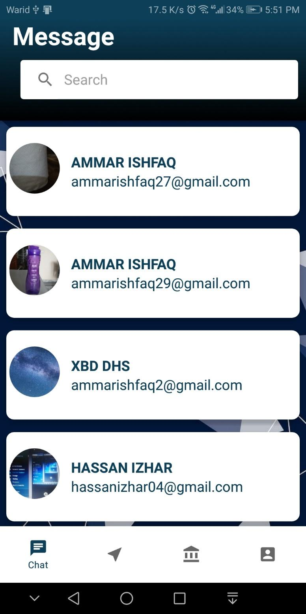
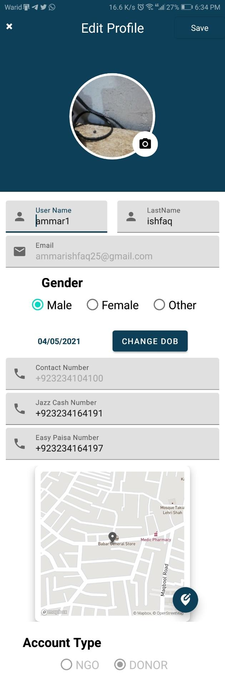

# NGO Management App

## Overview

This app facilitates seamless management of donations for NGOs, providing donors with transparency and the ability to track their contributions. NGOs can upload client details for donor verification.

## Features

- **Donor Transparency:** Access client information to build trust and verify donations.
- **Track Contributions:** Donors can easily monitor and keep track of their donations.
- **Deprecated Mapbox Version:** Note that this repo is built with a deprecated version of Mapbox.
- **Mapbox SDK Version:** Please note that this app uses Mapbox SDK version 9.

## Usage

1. **Donor Verification:** NGOs upload specific client details for donor reference.
2. **Transparency:** Donors can verify and cross-check client information for increased confidence.
3. **Tracking Donations:** Keep a record of all donations made through the app.

## Dependencies

To run this project, you need the following dependencies:

- Firebase Realtime Database
- Firebase Authentication
- Mapbox Key (place in `build.gradle` file)

## How to Run

1. Add your Mapbox key to the `build.gradle` file.
2. Set up Firebase Realtime Database and Authentication.
3. Run the project.

## Contributions and Issues

Contributions and issues are welcome! Feel free to [contribute](CONTRIBUTING.md) to the development of the NGO Management App. If you encounter any issues or have suggestions, please [create an issue](https://github.com/Ammar-Ishfaq/NGOs-Managment/issues).

## Project Images

| Image Preview | Image Preview | Image Preview | Image Preview |
|---------------|---------------|---------------|---------------|
|  |  |  |  |
|  |  |  |  |
|  |  |  |  |
|  |  |  |               |

## License

This project is licensed under the [MIT License](LICENSE).
